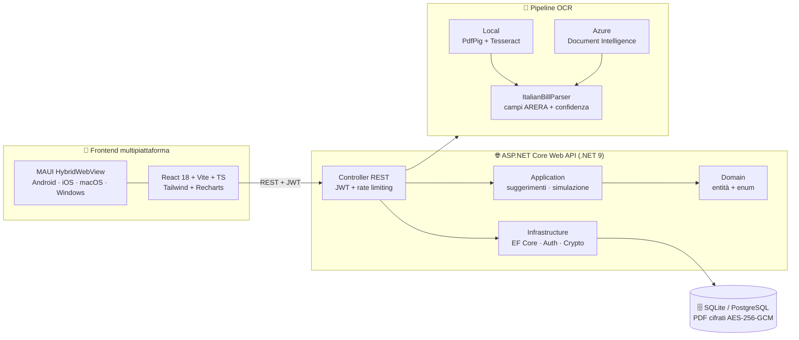

<div align="center">

# ⚡ Bolletta Analyzer

### Capisci la tua bolletta. Risparmia davvero.

App **mobile & desktop** che traduce le bollette di luce e gas in numeri chiari:
OCR reale, analisi dei consumi per fascia, consigli di risparmio personalizzati
e previsione della prossima bolletta.


**Android · iOS · macOS · Windows · Web**

</div>

---

## ✨ Cosa fa

| | Funzionalità | Come |
|---|---|---|
| 🧾 | **Legge la bolletta per te** | Carichi il PDF o una foto: OCR reale + parser ARERA estraggono importo, periodo, consumi F1/F2/F3, Smc e voci di costo |
| 📊 | **Spiega ogni euro** | Breakdown della spesa (materia energia, trasporto, oneri, imposte) con grafici chiari |
| ⏱️ | **Analizza le fasce orarie** | Scopri quanto consumi in F1/F2/F3 e dove conviene spostare i consumi |
| 💡 | **Consigli su misura** | Motore euristico che confronta i tuoi prezzi col mercato e stima il risparmio annuo |
| 🔌 | **Simula gli elettrodomestici** | Impatto di ogni dispositivo su consumi e costi (`kWh = W×h/1000`) |
| 🔮 | **Prevede la prossima bolletta** | Dall'auto-lettura del contatore: consumo proiettato, materia prima, quota fissa, imposte |
| 🔒 | **Protegge i tuoi dati** | Contratto PDF cifrato **AES-256-GCM** a riposo, bollette mai salvate come file, export & cancellazione account (GDPR) |

---

## 🎨 Anteprima dell'app

Un **prototipo HTML navigabile** con tutte le maschere (Landing, Accesso, Dashboard,
Simulatore, Profilo & Contratti) e dati d'esempio è incluso nel repo:

**👉 [`docs/prototipo-app.html`](docs/prototipo-app.html)** — scaricalo e aprilo nel browser:
zero dipendenze, si naviga cliccando la barra in alto o la bottom-nav.

| Maschera | Cosa mostra |
|----------|-------------|
| 🏠 **Landing** | Hero animato + onboarding a carosello + vantaggi |
| 🔐 **Accesso** | Login / registrazione con toggle |
| 📊 **Dashboard** | Upload bolletta, totale, torta della spesa, istogramma fasce, consigli |
| 🔌 **Simulatore** | Elettrodomestici, impatto consumi, auto-lettura, previsione bolletta |
| 👤 **Profilo** | Anagrafica, contratti Luce/Gas, documento cifrato |

---

## 🏛️ Architettura

**Clean Architecture** sul backend, **SPA React dentro MAUI HybridWebView** sul frontend:
una sola UI per tutte le piattaforme.



```
src/
├─ Backend/                              # Clean Architecture
│  ├─ BollettaAnalyzer.Domain/           #   entità di dominio + enum (zero dipendenze)
│  ├─ BollettaAnalyzer.Application/      #   DTO, interfacce, servizi (suggerimenti, simulazione)
│  ├─ BollettaAnalyzer.Infrastructure/   #   EF Core, JWT+BCrypt, AES-GCM, OCR (Services/Ocr/)
│  └─ BollettaAnalyzer.Api/              #   controller REST, Swagger, rate limiting, CORS
└─ Frontend/
   └─ BollettaAnalyzer.Maui/             # host nativo multipiattaforma
      └─ ClientApp/                      # SPA React + Vite + TypeScript + Tailwind + Recharts
```

---

## 🚀 Quick start

> Prerequisiti: **.NET SDK 9.0** · **Node.js 20+** · (per mobile) `dotnet workload install maui`

**1 · Backend** — API su `http://localhost:5080`, Swagger su `/swagger`

```bash
cd src/Backend/BollettaAnalyzer.Api
dotnet run
```

> Al primo avvio in **Development** crea il DB SQLite e i dati demo:
> login **demo@bolletta.app** / **Password1!** (mai creati in produzione).

**2 · Client React** — hot reload su `http://localhost:5173`

```bash
cd src/Frontend/BollettaAnalyzer.Maui/ClientApp
npm install
cp .env.example .env.local     # VITE_USE_MOCK=false per usare l'API reale
npm run dev
```

> 💡 Con `VITE_USE_MOCK=true` la SPA gira **senza backend**, sui dati mock.

**3 · App nativa (MAUI)**

```bash
cd src/Frontend/BollettaAnalyzer.Maui
dotnet build -t:Run -f net9.0-android   # oppure net9.0-windows / -ios / -maccatalyst
```

La build MAUI compila da sola il client React e lo impacchetta in
`Resources/Raw/wwwroot` (disattivabile con `-p:SkipClientBuild=true`).

---

## 🧾 OCR bollette — provider selezionabili

Pipeline reale configurabile da `appsettings.json` → `Ocr:Provider`:

| Provider | Come funziona | Quando usarlo |
|----------|---------------|---------------|
| **`Local`** *(default)* | PDF digitali → testo con **PdfPig** · foto/scansioni → **Tesseract** (`ita`) | Zero cloud: i PDF elettronici funzionano subito |
| **`Azure`** | **Azure AI Document Intelligence** (`prebuilt-invoice`) + parser di dominio | Scansioni difficili, massima accuratezza |
| **`Mock`** | Dati fittizi | Demo e sviluppo UI |

Qualunque sia la sorgente, **`ItalianBillParser`** estrae i campi delle bollette italiane —
importo, numero fattura, periodo, consumi **F1/F2/F3**, **Smc** gas, voci **ARERA** — e
calcola una **confidenza (0-1)**: sotto la soglia l'upload viene rifiutato con un messaggio
chiaro (**422**) e i dati precedenti restano intatti; sopra, la confidenza viene salvata e
mostrata in Dashboard.

<details>
<summary><b>⚙️ Configurazione OCR</b></summary>

```jsonc
"Ocr": {
  "Provider": "Local",            // Local | Azure | Mock
  "MinPdfTextLength": 40,
  "Tesseract": { "DataPath": "./tessdata", "Language": "ita" },
  "Azure": { "Endpoint": "", "ApiKey": "", "ModelId": "prebuilt-invoice" }
}
```

- **Local + immagini**: serve `tessdata/` con `ita.traineddata`
  ([download](https://github.com/tesseract-ocr/tessdata)); su Linux anche
  `apt install libtesseract-dev libleptonica-dev`.
- **Azure**: imposta `Endpoint` e `ApiKey` via secret/variabile d'ambiente.

</details>

---

## 🔐 Sicurezza & privacy

- 🔑 **Fail-fast in produzione**: senza `Jwt:Key` ed `Encryption:Key` configurate l'app
  **rifiuta di partire** — mai chiavi di default fuori da Development.
- 🛡️ **AES-256-GCM** per il PDF di contratto a riposo; decifratura al volo solo al download.
- 🧾 **Bollette senza file**: si conserva solo il dato estratto dell'ultima bolletta per
  contratto; il file originale non viene mai salvato.
- 🚦 **Rate limiting** su login/registrazione + verifica BCrypt a tempo costante.
- ✅ **Upload validati**: solo PDF reali (magic byte), Content-Type forzato, input con
  regole di dominio (niente letture future o contatori che "tornano indietro").
- 🇪🇺 **GDPR**: `GET /api/auth/export` (portabilità) e `DELETE /api/auth/account`
  (diritto all'oblio, con ri-autenticazione).
- 🔍 Audit completo del codice in [`falle.md`](falle.md), con stato di ogni correzione.

---

## 🔌 API REST

<details>
<summary><b>Elenco endpoint</b> (Swagger in sviluppo su <code>http://localhost:5080/swagger</code>)</summary>

| Metodo | Rotta | Descrizione |
|--------|-------|-------------|
| POST | `/api/auth/register` | Registrazione → JWT |
| POST | `/api/auth/login` | Login → JWT |
| GET  | `/api/auth/me` | Profilo corrente |
| PUT  | `/api/auth/profilo` | Aggiorna anagrafica |
| GET  | `/api/auth/export` | 🇪🇺 Esporta tutti i dati (JSON) |
| DELETE | `/api/auth/account` | 🇪🇺 Elimina account e dati collegati |
| GET/POST/PUT/DELETE | `/api/contratti` | CRUD contratti Luce/Gas |
| GET/POST/DELETE | `/api/contratti/{id}/documento` | PDF contratto cifrato (info / upload / elimina) |
| GET  | `/api/contratti/{id}/documento/download` | Scarica il PDF (decifrato al volo) |
| GET  | `/api/bollette` | Bollette (solo l'ultima per contratto) |
| GET  | `/api/bollette/{id}` | Analisi completa (breakdown + fasce + consigli) |
| POST | `/api/bollette/upload` | Upload PDF/foto → OCR → analisi (sostituisce la precedente) |
| GET/POST | `/api/letture` | Auto-letture contatore (`/ultima`; storico max 3) |
| GET/POST/PUT/DELETE | `/api/dispositivi` | CRUD elettrodomestici |
| POST | `/api/simulazione/dispositivi` | Impatto aggregato dei dispositivi |
| POST | `/api/simulazione/previsione` | Previsione prossima bolletta da auto-lettura |

</details>

<details>
<summary><b>🗄️ Database: SQLite ↔ PostgreSQL</b></summary>

```jsonc
"Database": { "Provider": "Sqlite" },      // oppure "Postgres"
"ConnectionStrings": { "Default": "Data Source=bolletta.db" }
```

Switch da configurazione, nessuna modifica al codice.

</details>

---

## 🗺️ Roadmap

Le prossime tappe — dalle fondamenta (correzione manuale post-OCR, storico pluriennale,
notifiche push) ai differenziatori unici (confronto offerte ARERA sui consumi reali,
inoltro bollette via email, assistente AI, simulatore fotovoltaico) — sono descritte in
[`falle.md → "Cosa NON può mancare"`](falle.md#-cosa-non-può-mancare-e-cosa-renderebbe-lapp-unica-sul-mercato).

## 📚 Documentazione

- 🏛️ [`docs/ARCHITETTURA.md`](docs/ARCHITETTURA.md) — scelte architetturali e formule di dominio
- 🎨 [`docs/prototipo-app.html`](docs/prototipo-app.html) — prototipo navigabile di tutte le maschere
- 🔍 [`falle.md`](falle.md) — audit di sicurezza con stato correzioni + roadmap prodotto

## 📜 Licenza

**Proprietaria — tutti i diritti riservati.** Il codice non può essere usato, copiato o
distribuito senza autorizzazione scritta. Dettagli in [`LICENSE`](LICENSE).

---

<div align="center">
<sub>⚡ Bolletta Analyzer — perché ogni euro in bolletta merita una spiegazione.</sub>
</div>
